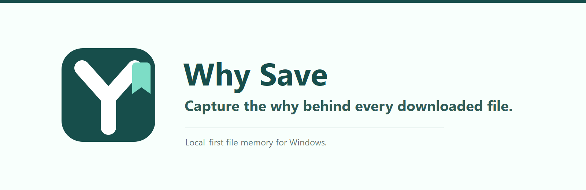

<p align="center">
  
</p>

# Why Save

We download files and forget why. Months later a file surfaces and its purpose is gone. **Why Save** closes that gap: a local-first Windows tray app that watches your Downloads folder, gently asks "why did you save this?" at the moment it happens, stores the answer encrypted in a local SQLite database, and lets you search it months later.

## Install

1. Download `WhySave.msi` from the releases page.
2. Double-click to install — no admin/UAC prompt required (per-user install to `%LOCALAPPDATA%\Programs\WhySave\`).
3. Why Save starts automatically on next login and appears in your system tray.

> **Windows warning:** The MSI may show a Windows SmartScreen or antivirus-style warning because the installer is not code-signed yet. If you downloaded it from the official Why Save releases page, choose **More info** → **Run anyway** to continue.

Alternatively, download the self-contained `WhySave.App.exe`, place it anywhere, and run it directly.

## Usage

- **Tray icon**: Left-click to open Find. Right-click for the full menu (Find, Memory Inbox, Settings, Pause watching, Exit).
- **Global hotkey**: `Ctrl+Win+Y` opens Find from anywhere. Reconfigure in Settings.
- **New file appears**: A native toast asks "Why did you save this?" with `Add Context` and `Later` actions.
  - `Add Context` opens a form: Reason, Project, Source URL, Notes, Saved date.
  - `Later` or dismiss: the file stays in the **Memory Inbox** for later processing.
- **Memory Inbox**: Lists pending files (`🔴 N files need context` in the tray menu). Bulk-select to dismiss to imported or delete records.
- **Find**: Browse recent imported/contexted files by default, or search filenames, projects, URLs, reasons, and notes from one place.

### Settings

- **Watched folders**: Add/remove folders to monitor (default: Downloads). Changes apply immediately.
- **Junk rules**: Editable allow/block glob lists and minimum file size. Allow overrides block.
- **Hotkey**: Configure the global hotkey (default `Ctrl+Win+Y`). Conflict reporting included.
- **Start with Windows**: Toggle (default ON).
- **Encryption**: View status, rotate key, export data (JSON), clear all data.
- **Auto-update**: Opt-in stable channel (default OFF). Checks a release feed on launch and daily.
- **Verbose logging**: Toggle for watcher debugging.

## Data Location

| Item | Path |
|------|------|
| Database | `%LOCALAPPDATA%\WhySave\whysave.db` |
| Encryption key | `%LOCALAPPDATA%\WhySave\key.bin` (DPAPI-sealed) |
| Settings | `%LOCALAPPDATA%\WhySave\settings.json` |
| Logs | `%LOCALAPPDATA%\WhySave\logs\` (5 files × 1 MB, rolling) |
| Install | `%LOCALAPPDATA%\Programs\WhySave\` |

## Privacy

- **No account, no telemetry, no outbound data flow.** All data stays on your machine.
- `reason` and `notes` fields are encrypted at rest with AES-GCM. The encryption key is sealed with Windows DPAPI (CurrentUser scope) — only your Windows user can decrypt it.
- Metadata (filename, path, project, URL, dates, status) is stored in plaintext for search.
- Logs intentionally exclude decrypted reason text and full URL strings. Only filenames, paths, statuses, and event kinds are logged.
- The only outbound request is the opt-in auto-update feed check (HTTPS GET to the latest GitHub Release's `feed.json`), which sends no data beyond the version query. Default is OFF.

## Architecture

```
WhySave.sln
├── src/
│   ├── WhySave.App/         WPF tray app, UI, DI host, toasts, settings
│   ├── WhySave.Core/        Watcher, detection pipeline, identity resolver, ingester, search
│   ├── WhySave.Storage/     SQLite (Microsoft.Data.Sqlite + Dapper), schema, migrations, FTS5
│   ├── WhySave.Crypto/      AES-GCM encryption + DPAPI key storage
│   └── WhySave.Native/      P/Invoke: NTFS file ID, hotkey, single-instance mutex
└── test/
    └── WhySave.Tests/       xUnit unit + integration tests
```

### Building from source

```powershell
dotnet build WhySave.sln
dotnet test WhySave.sln
```

### Publishing a self-contained exe

```powershell
dotnet publish src\WhySave.App\WhySave.App.csproj -c Release -r win-x64 --self-contained true -p:PublishSingleFile=true -p:PublishReadyToRun=true
```

### Building the MSI

```powershell
# Requires WiX v4: dotnet tool install --global wix --version 4.*
powershell -ExecutionPolicy Bypass -File installer\build-msi.ps1
```

## v2.0 Roadmap

- Browser extension for automatic source-URL capture (the ingestion seam `IFileIngester.IngestAsync` is designed for this — the extension calls it via a loopback HTTP listener with `Source = "extension"` and a real URL, no storage or pipeline changes needed)
- Shell right-click "Why did I save this?"
- Natural-language search ("show files for my ML assignment")
- Weekly cleanup reminders
- Normalized `projects`/`tags`/multi-source tables
- Firefox extension, cross-platform (Avalonia)

## Tech Stack

- .NET 8, WPF, C#
- SQLite (Microsoft.Data.Sqlite + Dapper) with FTS5
- AES-GCM encryption with DPAPI key sealing
- CommunityToolkit.Mvvm (MVVM pattern)
- H.NotifyIcon.Wpf (tray icon)
- In-app WPF notification windows (reliable in-process prompts)
- Serilog (rolling file logs)

## Community Standards

- [Contributing](CONTRIBUTING.md)
- [License](LICENSE)

## License

MIT. See [LICENSE](LICENSE).
